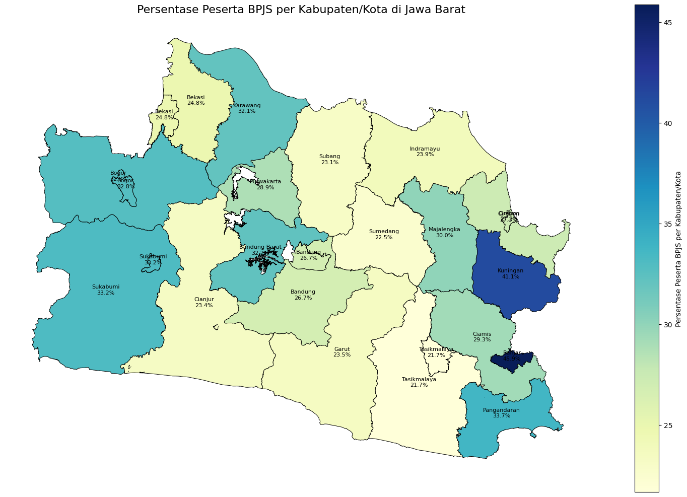
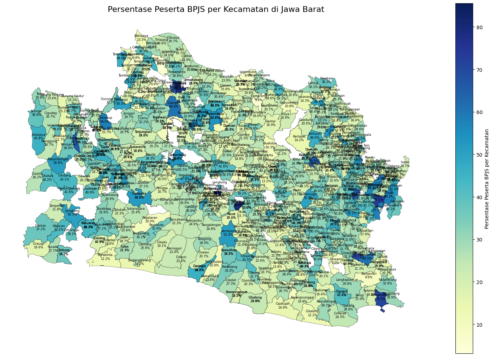
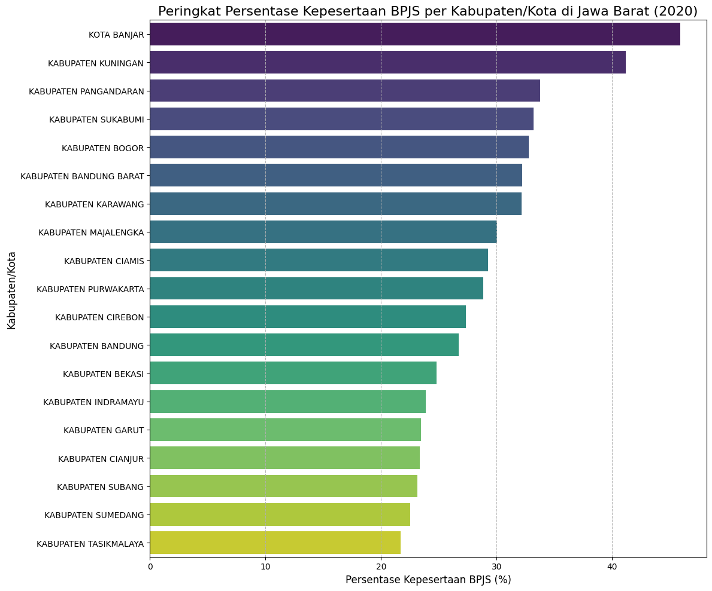

# Project-Matakuliah-Big-Data
**Analisis Spasial dan Faktor Aksesibilitas Terhadap Tingkat Kepesertaan BPJS di Jawa Barat (2020)**

Repositori ini merupakan tugas matakuliah Big Data, Study Kasus Analisa Big Data menggunakan pendekatan pengembangan perusahaan atau penyelesaian permasalahan pada suatu perusahaan terkemuka sesuai dengan industri. Industri yang saya pilih yaitu pada industri kesehatan dalam BPJS. Isinya adalah studi kasus analisis data untuk membedah persebaran kepesertaan BPJS Kesehatan di Provinsi Jawa Barat serta menginvestigasi faktor-faktor aksesibilitas yang mempengaruhinya pada tahun 2020. 

## Struktur Proyek
---
## 1. Latar Belakang dan Tujuan Analisis

### 1.1. Konteks Masalah
Jaminan Kesehatan Nasional (JKN) yang diselenggarakan oleh BPJS Kesehatan adalah pilar utama Indonesia dalam mencapai *Universal Health Coverage (UHC)*. Analisis ini menggunakan data tahun 2020 untuk melihat persebaran kepesertaan BPJS penduduk di Jawa Barat yang diambil dari [Open Data Jabar].

### 1.2. Pertanyaan Analisis
Proyek ini dipandu oleh serangkaian pertanyaan, dari yang bersifat umum hingga mendalam:
* **Pertanyaan Awal:** Bagaimana peta persebaran tingkat kepesertaan BPJS di Jawa Barat pada tahun 2020?
* **Pertanyaan Lanjutan:** Wilayah (kabupaten/kota) mana saja yang memiliki tingkat kepesertaan tertinggi dan terendah?
* **Pertanyaan Mendalam:** Faktor aksesibilitas fisik apa (seperti jarak, ketersediaan, dan jenis fasilitas kesehatan) yang paling berpengaruh terhadap tingkat kepesertaan tersebut?

### 1.3. Sumber Data
* **Data Kependudukan & BPJS:** [Open Data Jabar](https://opendata.jabarprov.go.id/id) (Dataset Jumlah Penduduk & Jumlah Peserta BPJS per Desa/Kelurahan Tahun 2020).
* **Data Aksesibilitas Faskes:** [Open Data Jabar](https://opendata.jabarprov.go.id/id) (Dataset Sarana Kesehatan Terdekat & Waktu Tempuh Tahun 2020).
* **Data Geospasial:** [Jawa Barat GeoJSON by hitamcoklat](https://github.com/hitamcoklat/Jawa-Barat-Geo-JSON) (Digunakan untuk membuat peta).

---

## 2. Eksplorasi Data dan Pemetaan Awal (The "Where")

### 2.1. Persiapan Data
Proses ini mencakup pembersihan data, penggabungan dataset utama (kependudukan, BPJS, dan sarana).

### 2.2. Peta Persebaran Kepesertaan BPJS
Visualisasi geospasial menunjukkan adanya perbedaan yang jelas antara wilayah di Jawa Barat. Wilayah perkotaan dan industri cenderung memiliki warna yang lebih pekat (partisipasi lebih tinggi), sementara beberapa wilayah agraris dan pesisir menunjukkan partisipasi yang lebih rendah.

### 2.3. Analisis Deskriptif
Kabupaten/Kota dengan partisipasi tertinggi umumnya berada di sekitar pusat ekonomi, sedangkan yang terendah tersebar di beberapa wilayah yang lebih rura.

---

## 3. Analisis Mendalam - Menguji Hipotesis Sederhana

Pada tahap ini, saya menguji dua asumsi umum terkait aksesibilitas.

### 3.1. Hipotesis 1: Pengaruh Jarak (Waktu Tempuh)
* **Metode:** Analisis korelasi Pearson antara `waktu_tempuh` dan `persentase_bpjs`.
* **Hasil:** Koefisien korelasi yang ditemukan sangat rendah, yaitu **`0.03`**.
> **Interpretasi Awal:** Secara umum, tidak ditemukan hubungan linear yang kuat antara waktu tempuh dan tingkat kepesertaan secara keseluruhan. Ini menandakan bahwa jarak bukanlah faktor penentu utama.

### 3.2. Hipotesis 2: Pengaruh Ketersediaan Rumah Sakit
* **Metode:** Perbandingan rata-rata dan Uji T-Test antara kelompok desa yang `ADA` dan `TIDAK ADA` rumah sakit.
* **Hasil:** Perbedaan rata-rata sangat kecil (29.23% vs 28.86%) dengan P-value yang tinggi (tidak signifikan secara statistik).
> **Interpretasi Awal:** Ketersediaan rumah sakit di sebuah desa juga terbukti tidak secara signifikan meningkatkan rata-rata kepesertaan. Hipotesis sederhana bahwa 'lebih banyak infrastruktur besar = kepesertaan lebih tinggi' tidak terbukti.

---

## 4. Sintesis dan Wawasan Kunci - Kekuatan Analisis Gabungan 

Setelah hipotesis sederhana gagal, analisis dilanjutkan untuk menemukan interaksi antar variabel.

### 4.1. Analisis Peran Jenis Fasilitas Kesehatan
Hasil perbandingan rata-rata kepesertaan untuk setiap jenis faskes mengungkapkan pola yang tidak terduga:
> **Temuan Kunci:** Fasilitas kesehatan tingkat komunitas seperti **POLINDES** berasosiasi dengan kepesertaan tertinggi (30.74%), sementara **Rumah Sakit Umum** justru berasosiasi dengan kepesertaan terendah (24.39%).

### 4.2. Menghubungkan Semua Variabel
Dengan menggabungkan semua variabel, saya menemukan beberapa :
* **Rumah Sakit:** Wilayah dengan RS terdekat cenderung memiliki waktu tempuh terjauh DAN kepesertaan terendah. Ini adalah wilayah dengan tantangan ganda.
* **POLINDES:** Wilayah dengan POLINDES terdekat memiliki waktu tempuh yang juga jauh, NAMUN tingkat kepesertaannya tertinggi. Ini menunjukkan **efektivitas program dan kedekatan sosial di tingkat komunitas mungkin mampu mengalahkan tantangan jarak.**
* **Korelasi 0.03:** Korelasi `waktu_tempuh` yang lemah kini menjadi jelas. Ini disebabkan oleh adanya tren yang saling berlawanan di antara jenis faskes yang berbeda, yang saling meniadakan dalam perhitungan agregat.

---

## 5. Kesimpulan dan Rekomendasi (The "So What?")

### 5.1. Ringkasan Wawasan
* Faktor aksesibilitas sederhana seperti waktu tempuh dan ketersediaan RS secara umum bukanlah prediktor yang kuat untuk kepesertaan BPJS.
* **Jenis fasilitas kesehatan terdekat** adalah faktor pembeda yang paling signifikan, di mana faskes berbasis komunitas menunjukkan korelasi positif yang lebih kuat dibandingkan faskes rujukan besar.
* Keberhasilan program di tingkat akar rumput (seperti yang dijalankan di POLINDES) terbukti lebih berpengaruh daripada sekadar kedekatan geografis.

### 5.2. Rekomendasi (Actionable Insights)
> Untuk meningkatkan cakupan BPJS, pemerintah daerah disarankan untuk **memperkuat peran dan program pada fasilitas kesehatan primer dan komunitas** (Puskesmas, Pustu, Poskesdes, Polindes) karena memiliki kemungkinan lebih efektif dalam mendorong pendaftaran dan kesadaran masyarakat. Serta perlu diadakan sosialisasi tentang BPJS Kesehatan di tiap Desa di Jawa Barat.

### 5.3. Keterbatasan dan Pengembangan Selanjutnya
> Analisis ini menggunakan data tahun 2020. Analisis lanjutan dapat menggabungkan data sosio-ekonomi (seperti tingkat pendapatan, UMK, atau tingkat pendidikan per wilayah) untuk memperkaya model dan mendapatkan pemahaman yang lebih komprehensif.
